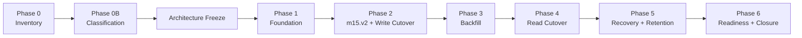

# M15 Architecture Freeze - Production Object Storage

**Date:** 28 iulie 2026
**Status:** Amended and frozen - `m15.v2` hybrid recovery contract
**Implementation status:** WP2H0 documentation authorized; WP2H1 and later implementation not authorized
**Frozen source:** `M15_TECHNICAL_PLAN.md` plus approved Phase 0 and Phase 0B evidence
**Critical blockers addressed:** `PR-C-003`, `PR-D-002`

---

## 1. Executive Architecture Summary

### 1.1 Decision

M15 adopts a private S3-compatible object-storage contract, with AWS S3 as the recommended production provider and MinIO as the isolated integration-test implementation. PostgreSQL remains authoritative for `ImageAsset` metadata and lifecycle state; object storage becomes authoritative for normalized image bytes. The Next.js application remains the only client authorization boundary.

The bucket must block public access, disable ACL-based ownership, require TLS, enable server-side encryption and versioning, and use least-privilege workload identity. Browser-held credentials, public URLs, direct browser uploads, presigned download redirects, and storage locators in API responses are outside the frozen scope.

Object keys are deterministic and PII-free:

```text
v1/owners/<ownerUserId>/assets/<assetId>/original
```

Every metadata, download, analysis, review, and delete operation is scoped by both asset ID and authenticated `ownerUserId` before an object-store call. Unknown and cross-owner resources use non-disclosing responses. Provider IAM reinforces but never replaces application authorization.

### 1.2 Persistence and Lifecycle

M15 adds an explicit lifecycle: `pending_upload`, `available`, `delete_pending`, `deleted`, and `quarantined`. New uploads become visible only after normalized bytes are checksummed, uploaded, verified through provider metadata, and finalized in PostgreSQL. Cross-system partial failures use compensating deletion and reconciliation; provider calls are never held inside long database transactions.

Download remains an authenticated application proxy. It streams a version-pinned private object with safe content headers and no shared caching. Delete becomes a durable metadata transition: access stops immediately, physical deletion occurs only after retention expiry through an audited, idempotent admin operation, and failures remain retryable.

Schema deployment is additive. M15a introduces nullable object-reference fields so legacy rows remain readable. After verified migration, M15b validates final invariants and makes storage state explicit. `storagePath` remains temporarily for legacy M13 and rollback compatibility; its removal is not part of M15.

### 1.3 Migration and Recovery

Phase 0/0B established that the current local baseline is `ai_hair_architect_test`, contains zero `ImageAsset` rows, and that all 222 orphan files are test/fixture artifacts. They are excluded from business backfill and must not be assigned owners, moved, or deleted without separate approval. This finding is local/test-only and makes no production-data claim.

For any future environment with authoritative local assets, migration is online and row-by-row: validate source confinement, checksum bytes, upload to the deterministic key, verify size/checksum/version, switch metadata conditionally, and retain the local source read-only through the rollback window. Final cutover requires zero active local rows, zero stale pending uploads, zero missing/mismatched objects, and zero duplicate keys.

M13 `m13.v1-v3` behavior, canonicalization, checksums, fingerprints, fixtures, and dispatch remain immutable. `m15.v1` also remains immutable, strictly object-only, and permanently compatible; it is never relabeled or converted implicitly. All backups newly created during the hybrid Phase 2 period use `m15.v2`, whose exact-key `ImageAsset` union discriminates `legacy-local` from `object-backed` state. Backup verification and restore must prove every local or object reference before destructive database work. Safety backups for local, object-backed, or mixed state must be complete `m15.v2` artifacts, with local files retained and referenced object versions protected through the rollback window.

### 1.4 Readiness and Closure

`STORAGE_PRODUCTION_POLICY_READY` remains `FAIL` through Phases 1-5. It can pass only when the production backend is `s3`, configuration and credentials validate, private/encrypted/versioned bucket capability is proven, a bounded canary or recent signed capability result succeeds, PostgreSQL reports no active local/incomplete references, reconciliation is clean, and production local writes/fallback are disabled.

M15 may resolve storage blockers without making the application globally ready: Billing authenticity remains independent. No blocker status changes before Phase 6 closure evidence.

### 1.5 Frozen Boundaries

The following cannot change without a revised architecture review:

- S3-compatible private-object contract and AWS S3 production recommendation;
- authenticated proxy download rather than public/presigned download;
- PostgreSQL metadata authority and object-store byte authority;
- deterministic PII-free keys and owner-scoped lookup before provider access;
- additive two-step schema and explicit lifecycle state machine;
- object-only new writes before online backfill;
- immutable M13 behavior, immutable object-only `m15.v1`, and a distinct additive hybrid `m15.v2` recovery contract;
- test/fixture exclusion for the 222 Phase 0 artifacts, with no deletion authorization;
- storage readiness remains fail-closed until Phase 6;
- no extension of the legacy root runtime or changes to AI analysis semantics.

Any change to these decisions, phase ordering, protected components, or approved file scope is an automatic `NO-GO` pending freeze amendment.

---

## 2. Definitive Phase List

| Phase | Name | State | Primary outcome |
|---|---|---|---|
| 0 | Baseline and read-only inventory | closed | Exact local database/storage inventory without mutation |
| 0B | Baseline verification and anonymous classification | closed | Local test baseline confirmed; storage classified as test/fixture data |
| 1 | Additive storage foundation | not approved | Provider configuration, adapter, additive M15a schema, isolated tests; no runtime cutover |
| 2 | Recovery contract and object-write cutover | blocked by Phase 1 | Activate hybrid `m15.v2`, retain immutable `m15.v1`, then route new writes to object storage with temporary legacy reads |
| 3 | Online authoritative backfill | blocked by Phase 2 | Migrate only DB-authoritative legacy assets with resumable byte verification |
| 4 | Reconciliation and object-read cutover | blocked by Phase 3 | Validate M15b invariants and disable production local fallback |
| 5 | Restore, retention, and rollback qualification | blocked by Phase 4 | Prove recovery, retention, reconciliation, and protected-version rollback |
| 6 | Readiness and closure | blocked by Phase 5 | Derive storage readiness, close blockers, publish evidence |

Phase numbers and ownership boundaries are frozen. Phase 2 combines recovery-contract activation with write cutover because `m15.v2` must be active before the first object-backed production row. It may use separate commits inside the phase, but the phase gate is atomic.

---

## 3. Phase Gates and Definition of Done

### Phase 0 - Baseline and Read-Only Inventory

**GO entry:** read-only access approved; proposed script/report paths disclosed; no implementation authorization assumed.

**NO-GO:** database unavailable; storage root inaccessible; scan would expose secrets/PII or require mutation.

**Definition of Done:** exact active/deleted/incomplete counts, byte totals, owner-anonymized distribution, missing/unsafe/symlink findings, duplicate groups, backfill estimate, provider recommendation, Phase 1 file list, and GO/NO-GO criteria documented. Script statically audited as read-only.

**State:** complete and approved.

### Phase 0B - Baseline Verification and Anonymous Classification

**GO entry:** Phase 0 accepted; repository-bounded read-only classification approved.

**NO-GO:** database identity cannot be classified safely; source attribution requires personal-data inspection; scan would leave repository boundaries.

**Definition of Done:** configuration source, logical DB, host type, schema, six model counts, extension/size/magic/date distributions, fixture SHA comparison, root inventory, and source classification documented without secrets or identities.

**State:** complete and approved with conclusion `STORAGE CONTENT IS TEST/FIXTURE DATA`.

### Phase 1 - Additive Storage Foundation

**GO entry:** all must pass:

- this Architecture Freeze receives final approval;
- AWS S3 or a named compatible provider, region, residency, encryption, versioning, lifecycle, IAM, and credential policy are approved;
- Phase 0B test baseline and exclusion of the 222 artifacts from backfill are accepted without authorizing deletion;
- exact Phase 1 file scope and additive M15a schema are approved;
- isolated non-production object-store test environment uses synthetic data only;
- pre-phase inventory is reproducible or deltas are reviewed;
- separate implementation and Git-operation authorization is granted.

**NO-GO:** destructive schema operation; existing migration edit; tracked static credentials; image runtime/M13/readiness change; external production object use; unresolved provider semantics; file-scope expansion.

**Definition of Done:**

- S3-compatible contract, configuration validator, provider error taxonomy, and least-privilege runbook exist;
- M15a additive migration applies cleanly and after full lineage;
- nullable lifecycle/reference fields and indexes preserve legacy behavior;
- adapter `put/get/head/delete` passes isolated MinIO/S3-compatible integration tests;
- no upload/download/delete/image-analysis route is cut over;
- M13 and readiness behavior are unchanged and storage remains `FAIL`;
- lint, typecheck, focused tests, Prisma validation, migration tests, and build pass;
- rollback leaves additive fields unused and application behavior unchanged.

### Phase 2 - Recovery Contract and Object-Write Cutover

**GO entry:** Phase 1 DoD and checkpoint approved; provider capability evidence current; M15a deployed; Phase 2 API/M13 scope approved; rollback drill for pre-write state passed.

**NO-GO:** `m15.v2` is not active before object writes; legacy M13 or `m15.v1` shape/checksum/semantics change; hybrid state cannot be represented completely; owner isolation or conditional-write semantics fail; compensating cleanup is unproven; provider access is public or over-privileged.

**Definition of Done:**

- additive `m15.v2` creation/verification/preview/restore dispatch represents zero-asset, local-only, object-only, and mixed state while `m13.v1-v3` and object-only `m15.v1` remain behaviorally identical;
- every source row is strictly classified as valid `legacy-local`, valid `object-backed`, or inconsistent; an inconsistent row blocks the complete backup without omission or implicit conversion;
- new uploads use `pending_upload -> available` and never write locally;
- object bytes are verified by size, SHA-256, and version identity before availability;
- authenticated proxy download and owner-scoped metadata paths pass security tests;
- delete transitions to `delete_pending`; retention execution is not yet destructive unless Phase 5 authorizes it;
- temporary local read-only fallback applies only to explicit legacy rows;
- partial failures, retries, collisions, and orphan compensation pass tests;
- storage readiness remains `FAIL`.

### Phase 3 - Online Authoritative Backfill

**GO entry:** Phase 2 DoD/checkpoint approved; target environment has an approved authoritative inventory; test/fixture orphans are excluded; migration role and rollback window are approved.

**NO-GO:** missing authoritative metadata; inferred ownership; unsafe/symlink/outside-root source; size mismatch; destination checksum collision; provider policy failure; dirty migration history.

**Definition of Done:**

- deterministic batches are resumable and idempotent;
- every migrated asset passes source confinement, checksum, upload, `HEAD`, and conditional metadata switch;
- concurrent reads remain available and byte-consistent;
- no orphan is imported without DB authority;
- source files remain read-only through the rollback window;
- manifest reconciliation accounts for every authoritative row and object;
- failures are quarantined/reportable without fabricated success.

Each transition verifies the local source, uploads bytes, verifies exact version/size/SHA-256, conditionally switches PostgreSQL metadata, and retains the source through the rollback window. Historical artifacts remain byte-for-byte unchanged. Disabling new `legacy-local` creation requires zero active legacy assets, rollback-window expiry, resolved retention for dependent historical backups, and separate explicit approval.

For the approved local test baseline, authoritative backfill count is zero; Phase 3 still validates tooling and produces a zero-work reconciliation record.

### Phase 4 - Reconciliation and Object-Read Cutover

**GO entry:** Phase 3 DoD/checkpoint approved; reconciliation reports zero unexplained discrepancies; M15b SQL reviewed; rollback source window remains intact.

**NO-GO:** any active local row, stale pending upload, missing/mismatched object, duplicate key, incomplete active reference, cross-owner failure, or unvalidated M15b constraint.

**Definition of Done:**

- manifest, PostgreSQL, and provider inventory reconcile exactly;
- M15b constraints validate and final storage state is non-null for all rows;
- production reads are object-only and local fallback is disabled;
- upload/download/delete owner-isolation smoke tests pass across production-like instances;
- multi-instance and process-restart reads return identical bytes;
- local sources remain untouched until rollback-window approval;
- storage readiness remains `FAIL` pending recovery qualification.

### Phase 5 - Restore, Retention, and Rollback Qualification

**GO entry:** Phase 4 DoD/checkpoint approved; `m15.v1` compatibility and complete `m15.v2` artifacts are proven; required local files and object versions are protected; retention policy and destructive operations receive explicit authorization.

**NO-GO:** safety backup is M13 for object-backed or mixed state; any legacy file or target exact object version cannot be verified; restore permits fallback, omission, or partial mutation; lifecycle may remove rollback bytes; retention is unaudited or non-idempotent.

**Definition of Done:**

- object-only `m15.v1` remains compatible and `m15.v2` local-only, object-only, mixed, verification, preview, execution, postcondition, and safety-backup flows pass end to end;
- `m15.v2` restore performs complete pre-verification and all-or-nothing metadata mutation, with no filesystem/S3 fallback, latest-object fallback, asset omission, or reconstruction from metadata alone;
- missing/wrong checksum/wrong size/wrong version/unknown alias block restore;
- `m13.v1-v3` full regression remains unchanged;
- retention dry-run and authorized execution are bounded, audited, idempotent, and retryable;
- reconciliation handles pending, missing, and orphaned operation records safely;
- rollback drill restores metadata against protected object versions;
- runbook records RPO/RTO assumptions and external-byte backup responsibility.

### Phase 6 - Readiness and Closure

**GO entry:** Phases 0-5 DoD/checkpoints approved; full regression green; migration/restore/rollback evidence signed off; no open critical storage discrepancy.

**NO-GO:** any readiness prerequisite is stale/failed; local production writes/fallback remain; storage locators/secrets leak; M13/M8 regression fails; blocker closure lacks evidence; Billing status is incorrectly altered.

**Definition of Done:**

- `STORAGE_PRODUCTION_POLICY_READY` derives `PASS` only from all frozen capability and data invariants;
- bounded canary or signed capability evidence is current, with maximum 60-second cache and fail-closed expiry;
- zero active non-object rows and zero incomplete references are proven by indexed queries;
- production static scan finds no local storage writes or unintended `fs` imports;
- full lint, typecheck, Vitest, PostgreSQL, object-store, build, Playwright, M8, and M13 gates pass;
- `PR-C-003` and `PR-D-002` close with evidence; Billing remains independent;
- closure report and rollback runbook are approved;
- cleanup of local test/legacy files remains a separate authorization, not an implied closure action.

---

## 4. Phase Dependency Matrix

| Phase | Hard dependencies | Produces for next phase | Parallel work allowed |
|---|---|---|---|
| 0 | approved read-only scope | inventory and initial risks | none affecting baseline |
| 0B | Phase 0 | verified test baseline and provenance | documentation only |
| 1 | 0B + freeze approval + provider/security/schema decisions | additive schema, adapter, isolated capability evidence | bucket/IAM provisioning and adapter tests |
| 2 | Phase 1 | object-backed new-write path and hybrid `m15.v2`, with immutable `m15.v1` compatibility | M13 and `m15.v1` regression may run in parallel |
| 3 | Phase 2 | migrated authoritative rows and manifest | batches may run in parallel only with disjoint claims |
| 4 | Phase 3 | object-only reads and final constraints | smoke suites across instance classes |
| 5 | Phase 4 | qualified recovery, retention, reconciliation | non-destructive preview and dry-run suites |
| 6 | Phase 5 | readiness and closure evidence | independent full regression suites |



No phase may consume an unapproved output from a later phase. Schema foundation cannot include runtime cutover; write cutover cannot precede `m15.v2`; read cutover cannot precede reconciliation; readiness cannot precede recovery qualification.

---

## 5. Risk Matrix

Scales: probability `L/M/H`; impact `L/M/H/Critical`. Residual risk is evaluated after the frozen mitigation.

| ID | Risk | Probability | Impact | Frozen mitigation and gate | Residual |
|---|---|---:|---:|---|---:|
| R1 | DB/object partial commit | M | Critical | lifecycle state, conditional finalize, compensation, reconciliation; Phases 2/5 | M |
| R2 | Cross-owner object disclosure | L | Critical | owner-scoped query before provider call, private bucket, non-disclosing responses; Phases 2/4 | L |
| R3 | Credential or locator leakage | M | Critical | workload identity, no public/presigned flow, masking, serializer/static audits; Phases 1/6 | L |
| R4 | Existing source missing/corrupt | M | H | inventory, SHA-256, confinement, abort conditions, no inferred ownership; Phase 3 | L |
| R5 | Provider incompatibility despite S3 API | M | H | qualify checksum, `HEAD`, version, conditional write, delete semantics; Phase 1 | M |
| R6 | Provider outage/throttling | M | H | bounded retries/timeouts, stable `503`, fail closed, telemetry; Phases 1/2 | M |
| R7 | Object overwrite/collision | L | Critical | deterministic unique key, conditional create, checksum/version verification; Phase 2 | L |
| R8 | M13 or `m15.v1` semantic regression | M | Critical | immutable legacy dispatch/fixtures/checksums and immutable object-only v1; distinct additive `m15.v2`; Phases 2/5 | L |
| R9 | Backup restores metadata without bytes | M | Critical | external object verification before destructive work, protected versions; Phase 5 | L |
| R10 | Lifecycle deletes rollback versions | M | Critical | version hold window, safety-backup binding, rollback drill; Phase 5 | L |
| R11 | Mixed local/object reads diverge | M | H | object-only writes, explicit legacy fallback, row-level verified switch; Phases 2-4 | L |
| R12 | Readiness false positive | M | Critical | all-condition gate, indexed invariants, short TTL, stale evidence fails; Phase 6 | L |
| R13 | Readiness overload | L | H | bounded canary, cached capability, no provider listing/unbounded DB scan; Phase 6 | L |
| R14 | Test artifacts treated as business assets | L | Critical | Phase 0B classification, exclusion from backfill, no owner inference; Phase 3 | L |
| R15 | Rollback to code that cannot read object rows | M | H | additive schema, compatibility window, controlled `503`, forward-fix after cutover; Phases 2-5 | M |
| R16 | Scope expansion touches protected domains | M | H | exact phase scopes, checkpoint review, freeze amendment required; every gate | L |
| R17 | PII in keys/logs/backups | L | Critical | UUID-only keys, alias not physical bucket, masking and artifact audit; Phases 1/2/6 | L |
| R18 | Production baseline differs from local test baseline | H | Critical | environment-specific read-only inventory required before migration; Phase 3 | M |

Architecture review must explicitly accept residual `M` risks R1, R5, R6, R15, and R18 or prescribe stronger controls before their owning phase receives GO.

---

## 6. Planned Git Checkpoints

Checkpoint creation is never implicit. Each requires successful DoD evidence, review, and separate staging/commit authorization.

| Checkpoint | Trigger | Required evidence |
|---|---|---|
| `m15-phase0-baseline-inventory` | Phase 0 accepted | read-only audit and inventory report |
| `m15-phase0b-baseline-classification` | Phase 0B accepted | reproducible DB identity and fixture provenance |
| `m15-architecture-freeze` | this document approved | final architecture approval; no implementation |
| `m15-phase1-additive-storage-foundation` | Phase 1 DoD | M15a, adapter/config tests, unchanged runtime/M13/readiness |
| `m15-phase2-object-write-cutover` | Phase 2 DoD | hybrid `m15.v2`, immutable `m15.v1` regression, object writes, private reads, owner isolation, compensation |
| `m15-phase3-authoritative-backfill` | Phase 3 DoD | reconciled manifest and zero unexplained migration failures |
| `m15-phase4-object-read-cutover` | Phase 4 DoD | M15b validation, object-only reads, fallback disabled |
| `m15-phase5-recovery-retention-qualified` | Phase 5 DoD | restore/retention/reconciliation/rollback drill evidence |
| `m15-phase6-production-storage-closure` | Phase 6 DoD | readiness evidence and approved closure report |

Phase 0 and Phase 0B being closed does not itself authorize their checkpoint commits. No checkpoint may combine incomplete work from the following phase.

---

## 7. Protected Components and Change Control

The freeze protects:

- root legacy runtime files: `server.js`, `script.js`, `index.html`, `extension.html`, `styles.css`;
- analysis engines, thresholds, cutting plan, provider-result semantics, and M8 mapper semantics;
- Appointment, Notification, Client, Consultation, Webhook, Billing, and auth persistence behavior;
- business-persistence registry and M14 convergence;
- webhook cryptography, delivery state machines, retries, and secret versioning;
- M13 legacy versions, canonicalization, checksums, fingerprints, fixtures, dispatch, governance, maintenance, retention, observability, and alerts;
- independent Billing blocker and public-launch authorization;
- all 222 Phase 0 test artifacts from mutation absent separate approval.

Changes to shared backup files are permitted only as distinct additive `m15.v2` branches; existing M13 and `m15.v1` branches are immutable. Existing migration SQL is immutable. Any new production path outside the phase-approved inventory requires a freeze amendment before editing.

### 7.1 Frozen `m15.v2` Hybrid Contract

Every `m15.v2` `ImageAsset` uses exact-key validation and exactly one discriminator: `storageKind: "legacy-local"` with a complete `legacyReference`, or `storageKind: "object-backed"` with a complete exact-version `objectReference`. Both variants require common keys `id`, `fileName`, `mimeType`, `sizeBytes`, `ownerUserId`, `clientId`, `exifStripped`, `normalizedOrientation`, `uploadedAt`, `deletedAt`, `retentionDeletesAt`, `createdAt`, and `updatedAt`. Unknown discriminators, missing or additional fields, both payloads, payload/discriminator drift, partial metadata, and contradictory lifecycle state invalidate the complete artifact. No third implicit variant exists.

`legacy-local` additionally requires only `storageKind` and complete `legacyReference`; it forbids `storagePath`, `objectReference`, `storageEtag`, `storageState`, `storageMigratedAt`, `objectDeletedAt`, and `lastStorageErrorCode`. It uses logical root alias `legacy-images`, a canonical POSIX relative path, lowercase SHA-256, and positive bounded size. Absolute paths, drive letters, leading slashes, empty/`.`/`..` segments, traversal, symlink escape, owner/asset identity mismatch, and serialized M13 absolute `storagePath` are prohibited. The file must exist and match size/SHA-256 at creation; failure blocks the complete backup and no asset may be omitted.

`object-backed` additionally requires `storageKind`, complete `objectReference`, and present lifecycle keys `storageEtag`, `storageState`, `storageMigratedAt`, `objectDeletedAt`, and `lastStorageErrorCode`; it forbids `storagePath`, `legacyReference`, and every local root/path field. Its reference retains only logical `bucketAlias`, canonical key, non-empty exact `versionId`, lowercase SHA-256, and positive bounded size. Physical bucket, endpoint, credentials, tokens, public/presigned URLs, and latest-version fallback are prohibited. Only coherent `available` or `delete_pending` rows whose object still exists are restorable; `pending_upload`, `quarantined`, `deleted`, lifecycle drift, or unsafe error values block creation.

All six domains are read owner-scoped in one `RepeatableRead` transaction. Zero assets, local-only, object-only, and mixed state each create `m15.v2`; any inconsistent asset creates no backup. Preview verifies both reference classes independently with zero fallback, discloses no path/key/version/provider details, and uses `m15.restore-preview.v2`; M13 and `m15.v1` fingerprints remain unchanged. Execution requires complete pre-verification and all-or-nothing mutation.

### 7.2 WP2H Sequencing

The frozen implementation order is:

1. `WP2H0` - architecture amendment documentation;
2. `WP2H1` - contract and artifact core v2;
3. `WP2H2` - legacy and hybrid reference verification;
4. `WP2H3` - pure restore preview v2;
5. `WP2H4` - preview runtime integration;
6. `WP2H5` - creation and verification persistence;
7. `WP2H6` - HTTP activation;
8. `WP2H7` - restore execution core;
9. `WP2H8` - execution runtime and route wiring.

Each package requires its own read-only audit, exact allowlist, gates, approval, and implementation authorization. `WP2H0` changes documentation only and does not authorize or begin `WP2H1`.

---

## 8. Freeze Approval Boundary

Approval of this document freezes architecture and phase gates; it does not approve Phase 1 implementation, dependency installation, schema changes, migrations, external object operations, staging, commits, pushes, or cleanup.

Implementation can begin only after an explicit phase-specific GO. A phase that hits any NO-GO condition stops without entering the next phase. Exceptions require a revised Architecture Freeze and final review.